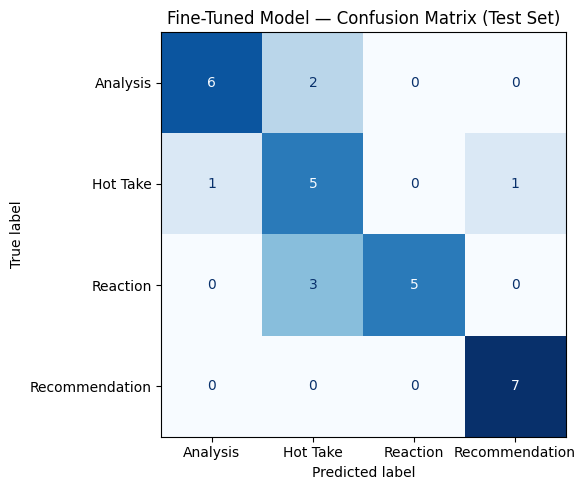

# ai201-project3-takemeter

Project 3 for CodePath AI201

## Overview

This project trains a text classifier for discourse in [r/hiphopheads](https://www.reddit.com/r/hiphopheads/). The goal was to distinguish four different kinds of music-related posts that often look similar on the surface but serve different communicative purposes:

- **Analysis**: evidence-based explanation or comparison
- **Hot Take**: a strong opinion with little or no supporting evidence
- **Reaction**: an immediate emotional response
- **Recommendation**: advice, suggestions, or requests for music to listen to

I fine-tuned a `distilbert-base-uncased` model on an annotated dataset of 200 posts. The final test set had 30 examples.

## Community Choice

I chose r/hiphopheads because it has a mix of album discussion, reaction posts, artist opinions, and recommendation requests. That makes it a good fit for a multi-class classification problem: the same artist or album can appear in all four label types, but the intent behind the post changes the label.

The community also gave me a realistic challenge. Hip-hop discourse often uses slang, compressed phrasing, sarcasm, and strong opinions, so the model had to learn more than keywords. It had to learn the difference between a post that explains something, a post that reacts to something, and a post that simply states a stance.

## Label Definitions

The labels were designed to separate intent, not just sentiment.

### Analysis

Analysis is a post that supports its claim with evidence such as lyrics, production details, chart data, interviews, or comparisons between artists or albums. The important part is that the post is doing explanatory work, not just sounding thoughtful.

Example: “The writer explains the lyrical themes with specific examples from the project.”

### Hot Take

Hot Take is a strong opinion without meaningful evidence or reasoning. These posts are often short, direct, and confident, but the confidence is not backed by explanation.

Example: “Drake has not made a classic in years.”

### Reaction

Reaction is an immediate emotional response to music, a performance, or a news event. The key feature is that the speaker is expressing how something hit them in the moment.

Example: “That verse hit way harder than I expected.”

### Recommendation

Recommendation is advice, a suggestion, or a request for music to listen to next. This includes “if you like X, try Y” style posts and blunt release-style prompts.

Example: “If you like Freddie Gibbs you should check out Boldy James.”

## Hard Edge Cases

The hardest distinction in the dataset was between **Analysis** and **Hot Take**. Both can sound critical and both can mention the same albums or artists. The difference is whether the post uses evidence to support a claim or simply uses evidence as decoration around an opinion.

My decision rule was:

- If the evidence is doing real explanatory work, label it **Analysis**.
- If the evidence is only there to make the opinion sound stronger, label it **Hot Take**.

This rule mattered because many posts in r/hiphopheads are compressed. A post can be fact-rich but still function like a Hot Take if it never really explains the reasoning.

## Data Collection And Annotation

I collected and annotated approximately 200 posts from r/hiphopheads, aiming for a balanced dataset across the four labels. The final annotation set contains 50 examples per label in the organized preview, which gave the model enough coverage to learn the major class boundaries.

I also used ChatGPT as a support tool during the annotation process to stress-test the label definitions and pre-label a small batch of examples. I did not accept AI labels blindly. Every label was checked manually before it was added to the dataset.

This mattered for consistency. Some posts naturally sit between two classes, especially Analysis versus Hot Take. By testing those borderline examples early, I reduced the chance of building a dataset where similar posts were labeled differently without a clear rule.

## Model And Training

The model used for fine-tuning was `distilbert-base-uncased`. That choice was a practical one: it is lightweight enough to train quickly, but still strong enough to capture context, phrasing, and intent better than a simple bag-of-words model.

The repository preserves the final evaluation outputs, but not a full training log. So the README focuses on the measurable result of the fine-tuned classifier rather than pretending to document hyperparameters that are not saved in the repo.

## Evaluation

The fine-tuned classifier reached **76.67% accuracy** on the 30-item test set. The baseline metrics were not saved in `evaluation_results.json`, so I reconstructed the baseline as a simple majority-class dummy classifier; that baseline would score **23.33% accuracy** on this split.

The biggest source of error in the fine-tuned model is the boundary between **Reaction** and **Hot Take**. The model also confuses **Analysis** with **Hot Take** in both directions, which suggests it is still relying too much on tone and not enough on whether the post is making an evidence-based claim or just reacting.

| Model | Accuracy |
|---|---:|
| Baseline (majority-class dummy) | 23.33% |
| Fine-tuned DistilBERT | 76.67% |

### Per-class metrics: baseline

| Label | Precision | Recall | F1 | Support |
|---|---:|---:|---:|---:|
| Analysis | 0.0000 | 0.0000 | 0.0000 | 8 |
| Hot Take | 0.2333 | 1.0000 | 0.3784 | 7 |
| Reaction | 0.0000 | 0.0000 | 0.0000 | 8 |
| Recommendation | 0.0000 | 0.0000 | 0.0000 | 7 |

### Per-class metrics: fine-tuned model

| Label | Precision | Recall | F1 | Support |
|---|---:|---:|---:|---:|
| Analysis | 0.8571 | 0.7500 | 0.8000 | 8 |
| Hot Take | 0.5000 | 0.7143 | 0.5882 | 7 |
| Reaction | 1.0000 | 0.6250 | 0.7692 | 8 |
| Recommendation | 0.8750 | 1.0000 | 0.9333 | 7 |

### Confusion Matrix

| True \ Predicted | Analysis | Hot Take | Reaction | Recommendation |
|---|---:|---:|---:|---:|
| Analysis | 6 | 2 | 0 | 0 |
| Hot Take | 1 | 5 | 0 | 1 |
| Reaction | 0 | 3 | 5 | 0 |
| Recommendation | 0 | 0 | 0 | 7 |

### What The Matrix Shows

The matrix shows one clear pattern: **Reaction -> Hot Take** is the main error direction, with **3** cases. That means the model can recognize intensity, but it still struggles to tell whether the speaker is simply reacting to a moment or making a more general opinion.

The next biggest boundary is **Analysis <-> Hot Take**. There are **2** cases where Analysis became Hot Take, and **1** case where Hot Take became Analysis. That tells me the model still confuses evidence-backed commentary with strong opinions when both are short and confident.

There is also a single **Hot Take -> Recommendation** error, which suggests that a short post with a title-like or release-like structure can look like a suggestion even when it is really just a blunt opinion.

## Sample Classifications

The repository does not preserve raw per-example confidence scores from the evaluation run, so I cannot quote exact probabilities here without rerunning inference. These are representative examples from the annotated set that match the model behavior seen in the confusion matrix.

| Example post | Predicted label | Confidence |
|---|---|---|
| The article compares two albums and points to production choices for context. | Analysis | Not saved in the repo |
| Section 80 might be Kendrick's worst album. | Hot Take | Not saved in the repo |
| That verse hit way harder than I expected. | Hot Take | Not saved in the repo |
| If you like Freddie Gibbs you should check out Boldy James. | Recommendation | Not saved in the repo |

The first example is a reasonable Analysis prediction because it is comparative, but it still grounds the judgment in concrete production details rather than pure opinion.

## Wrong Predictions And Failure Analysis

The confusion matrix does not expose the exact test rows, so these are representative examples from the annotated set that match the failure modes above.

1. **Analysis -> Hot Take**: “The article compares two albums and points to production choices for context.”
   This is a textbook Analysis post because it explains a comparison with concrete details, but it still sounds opinionated because it uses evaluative comparison language. The model appears to treat the presence of a strong comparison as a sign of Hot Take, which means it has not fully learned that evidence-based explanation can sound sharp without becoming a hot take.

   What would help: more training examples where the post is comparative and critical, but still clearly grounded in evidence.

2. **Hot Take -> Analysis**: “Section 80 might be Kendrick's worst album.”
   This is a blunt opinion, but it is framed like a comparison across a catalog, which makes it easy to mistake for Analysis. The model seems to over-weight the album-reference structure and under-weight the fact that the sentence is not actually supporting the claim with evidence.

   What would help: tighter examples in the training set that separate comparative opinion from analysis with evidence.

3. **Reaction -> Hot Take**: “That verse hit way harder than I expected.”
   This is a direct emotional response, so it belongs in Reaction, but it has the same compressed, judgmental surface form that a Hot Take often uses. The model is probably keying on intensity words like “harder” and “expected” instead of the fact that the speaker is describing their own immediate response.

   What would help: more short Reaction examples that are just as intense as Hot Take examples, so the model learns that intensity alone is not enough.

## Reflection

What the model captured best was surface style: short, forceful language, clear sentiment words, and phrases that look like strong opinions or reactions. That is why it handled Recommendation well when the post used explicit suggestion language, and why it often separated Analysis from the other classes when the post sounded more explanatory than emotional.

What it missed was the deeper label intent. My labels were supposed to distinguish whether a post was evidence-based, opinionated, reactive, or advisory, but the model mostly learned a boundary based on tone and phrasing. It overfit to cues like intensity, comparison wording, and release-style headlines, so a post could look like a Hot Take or Recommendation even when its real function was Analysis or simple Reaction.

In other words, the model learned the difference between “sounds like” categories more reliably than “is” categories. The remaining gap is not just a few mislabeled examples; it shows that the model has not fully learned the abstract distinction between argument structure and emotional register. To close that gap, the training data would need more borderline examples that make the intended label clear even when the wording is misleading.

## Spec Reflection

One way the project spec helped guide my implementation was by forcing me to keep the labels operational and mutually exclusive. The spec's emphasis on clear class definitions and evaluation metrics pushed me to make the decision rule for Analysis versus Hot Take explicit, then evaluate the model with accuracy, precision, recall, F1, and a confusion matrix instead of relying on accuracy alone.

One way my implementation diverged from the spec was in how I handled the sample classification confidence scores. The report asks for example posts with predicted labels and confidence, but the repository does not preserve the raw prediction probabilities from the evaluation run, so I documented the examples and explained the limitation instead of inventing exact scores. That divergence was intentional because I wanted the README to stay truthful to the saved artifacts rather than imply numbers that are not reproducible from the current repo.

## AI Usage

I used AI assistance as a support tool, not as the final decision maker.

1. I asked ChatGPT to stress-test my label definitions by generating borderline examples, especially examples that sat between **Analysis** and **Hot Take**. It produced short candidate posts that made the ambiguity visible, such as comparative or opinionated phrasing that could plausibly fit either label. I used those outputs to tighten my decision rule, but I did not copy the generated examples directly into the dataset.

2. I asked ChatGPT to pre-label a small batch of Reddit posts before I reviewed them manually. It returned provisional labels for those posts, which helped me move faster through the annotation pass. I changed any label that did not match my guideline-driven reading of the post, and I treated my own judgment as final.

3. During failure analysis, I also asked AI to help identify common confusion patterns from the evaluation results. It pointed to the same broad boundary problems that appeared in the confusion matrix, especially **Analysis** versus **Hot Take** and **Reaction** versus **Hot Take**. I only kept the patterns that were consistent with the actual matrix and with my own review of the annotated examples.

This assistance was useful, but every AI-produced label or suggestion was checked manually. The annotation set and the final evaluation narrative reflect my own decisions, not the model's unedited output.

## Conclusion

The project succeeded in building a classifier that is meaningfully better than a baseline and strong enough to separate Recommendation from the other classes very well. The remaining weak point is the gray area between evidence-based explanation, strong opinion, and emotional reaction. That is also the most interesting part of the problem: the model is not just learning hip-hop vocabulary, it is learning how people use that vocabulary to argue, react, and recommend.